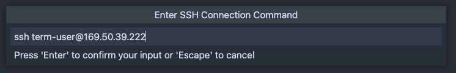
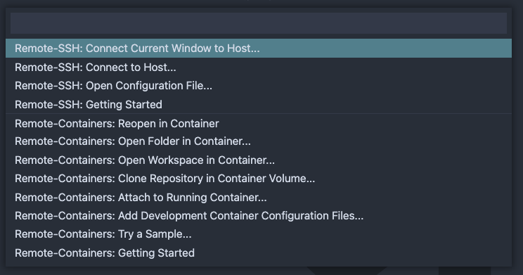

# VS Code Extension

Installiere die VS Code Extension: ms-vscode-remote.remote-ssh



Wählt die installierte Extension links in der Leiste aus

Mit dem "+" bei SSH Targets könnt ihr eine neue Verbindung anlegen. Gebt in das Feld "ssh &lt;username&gt;@&lt;ip-adress&gt;" ein.

Klickt auf das Symbol links unten in der Ecke und wählt "Remote-SSH: Connect Current Window to Host..." aus.

