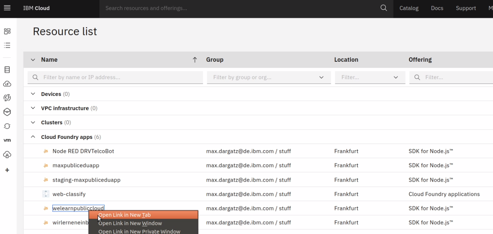

# Eure App im git und als Webanwendung

schaut euch die Files an, insbesondere "manifest.yaml" und findet eure Applikationsdetails wieder:

Öffnet einen neuen Tab 



und geht auf eure "Ressource List" und findet unter cloud foundry Apps eure App, clickt drauf und schaut euch an was eine PaaS out-of-the box kann \(zB CI/CD Integration, Logs, Connections & Runtime Monitoring & AutoScaling\).

Über diesen Link könnt ihr die minimalistische Node:JS Anwendung auch im Browser anschauen.

