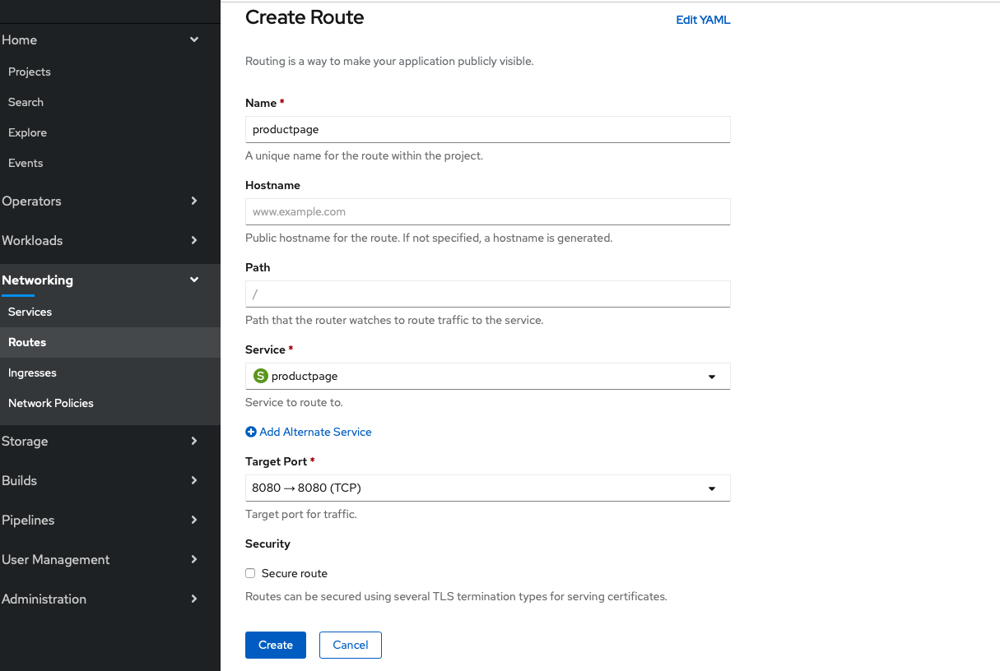
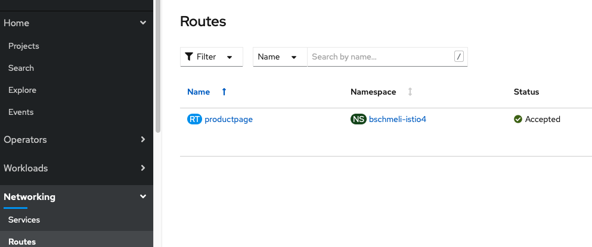
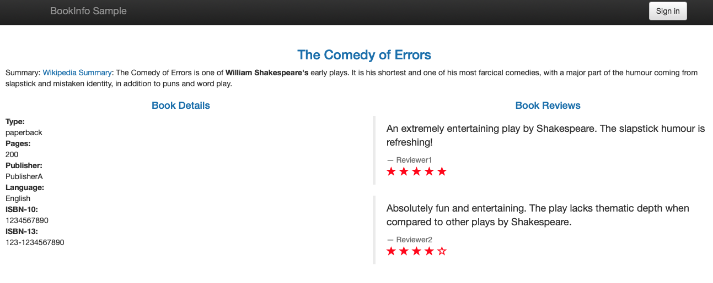

# Zugriff auf Productpage über eine Route

Die Applikation ist nun komplett und lauffähig. Wir können allerdings bisher nur innerhalb des Clusters auf die Anwendung zugreifen. Damit das auch von außerhalb des Clusters möglich wird benötigen wir eine Route zu unserer Productpage.

Hierfür wechseln wir in die Administrator View der Web Console und navigieren zu Networking/Routes und klicken auf Create Route.

In dem eingeblendeten Formular geben wir folgende Werte an:

* Name 
  * productpage
* Service
  * productpage
* Target Port
  * 8080

Die erstellte Route kann dann mittels der URL, die in dem Location Attribut referenziert wird konsumiert werden. Alternativ kann man über das Icon in der Topolgy View \(rechts über dem Kreis, der den Pod darstellt\) klicken.

Um die eigentliche Web Applikation in Aktion sehen zu können muss die URL noch um den Pfad /productpage ergänzt werden.

