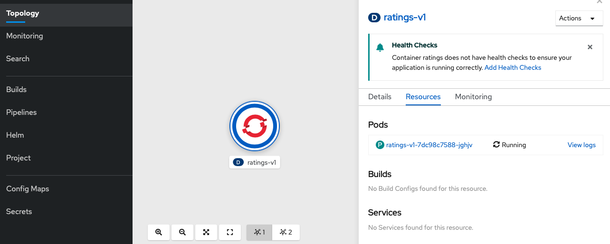

# Yaml Deployment über oc - ratings Service

Wir werden nun den Ratings Service per YAML deployen. Das YAML File liegt in diesem Fall in einem GitHub Repo, kann aber genauso auch lokal referenziert werden.

```text
oc apply -f https://raw.githubusercontent.com/Javatar81/istio-examples/master/bookinfo/ratings.yaml

service/ratings created
serviceaccount/bookinfo-ratings created
deployment.apps/ratings-v3 created
```

Es werden ein _Service_, _ServiceAccount_ und _Deployment_ erstellt. Letztere können wir auch in der Developer/Topology View in der Web Ui sehen.



