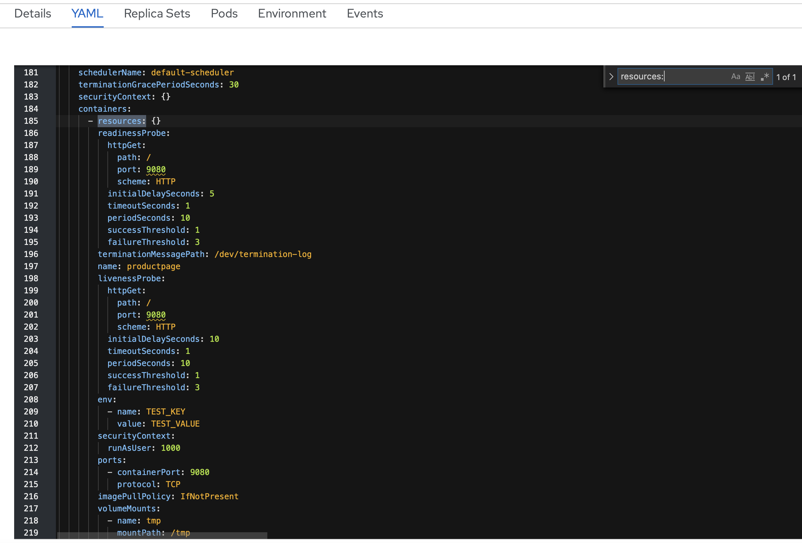
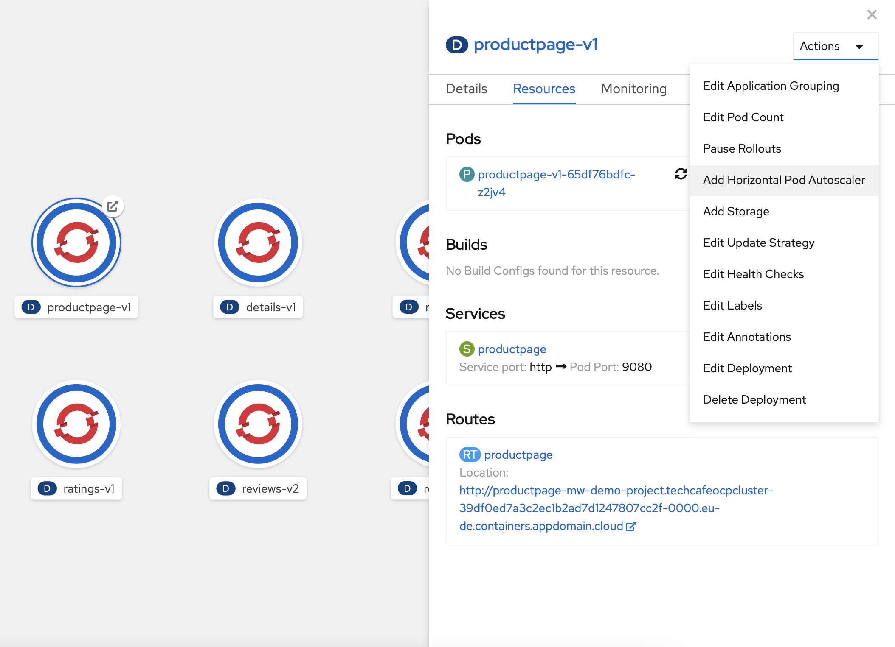
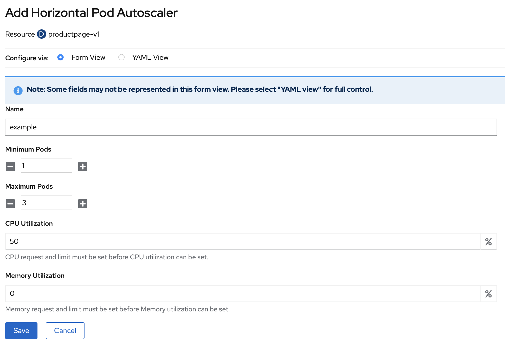

# Horizontal Pod Autoscaler via GUI & YAML

Um den Pod zu skalieren müssen die Resourcen Limits gesetzt sein. Dafür öffnen wir das Deployment und klicken auf YAML. Dort suchen wir nach "resources:"




Hier die "resources" innerhalb der Sektion "containers" anpassen!


Anstelle von "{}" tragen wir folgende Limits ein und klicken auf "Save":

```text
            limits: 
              cpu: 50m
              memory: 128Mi
            requests:
              cpu: 50m
              memory: 128Mi
```

Um ein automatisches Skalieren zu erwirken, müssen wir einen HorizontalPodAutoscaler erstellen. Hierzu klicken wir auf "Add Horizontal Pod Autoscaler"



Es öffnet sich der OpenShift Editor. Dort tragen wir die CPU Utilization von 45% ein und die Memory Utilization von ebenfalls **45%** und klicken auf "Save".



Alternativ kann auch per OC automatisch skaliert werden:

```text
oc autoscale deployment productpage --min=1 --max=3 --cpu-percent=5   

horizontalpodautoscaler.autoscaling/productpage autoscaled
```

Der Status des Autoscalers kann abgefragt werden, um zu checken, ob dieser ordnungsgemäß funktioniert:

```text
oc get horizontalpodautoscaler

NAME      REFERENCE                   TARGETS   MINPODS   MAXPODS   REPLICAS   AGE
example   Deployment/productpage-v1   32%/50%   1         3         1          2m29s
```

Wer noch einen http Load Generator wie in Session 4 und 3 zur Verfügung hat, kann auch versuchen den Autoscaler zu triggern:

```text
hey -c 100 -z 10s "http://<name-eurer-route>.techcafeocpcluster-39df0ed7a3c2ec1b2ad7d1247807cc2f-0000.eu-de.containers.appdomain.cloud/productpage"
```

