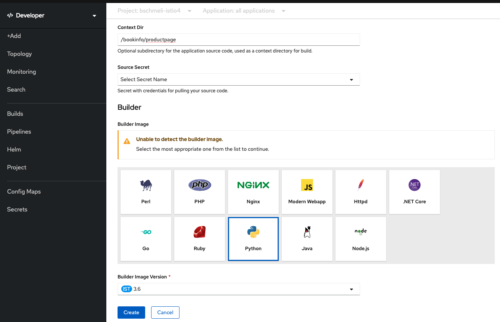
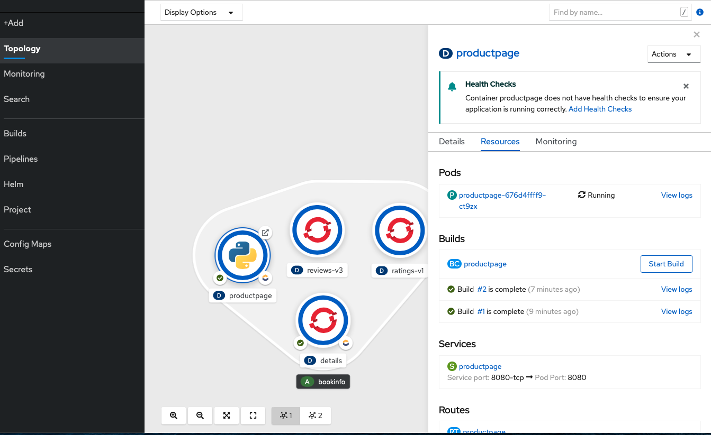

# Source2Image \(S2I\) Build & Deployment via WebConsole

Die letzte Komponente, die wir nun bauen und deployen ist die ProductPage. Diese wollen wir ohne Dockerfile direkt aus dem Sourcecode bauen und deployen. Dazu wählen wir **+Add** und **From Git** aus.

In dem Formular müssen wir nun angeben wo unser Source Code liegt und mit welchem Builder Image wir dieses bauen wollen. Hier wählen wir Python in **Version 3.6** aus.

Weiterhin müssen die folgedenen Werte angepasst werden:

* GIT Repo URL
  * [https://github.com/Javatar81/istio-examples.git](https://github.com/Javatar81/istio-examples.git)
* Context Dir
  * /bookinfo/productpage
* Builder Image
  * Python
* Application Name
  * bookinfo
* Name
  * productpage
* Create Route
  * No \(wir machen das im darauffolgenden Schritt separat\)

OpenShift erstellt für uns daraufhin wieder eine BuildConfig, Deployment, Service etc. Das Resultat des Build & Deploy Vorgangs kann in der Topology nachvollzogen werden.

