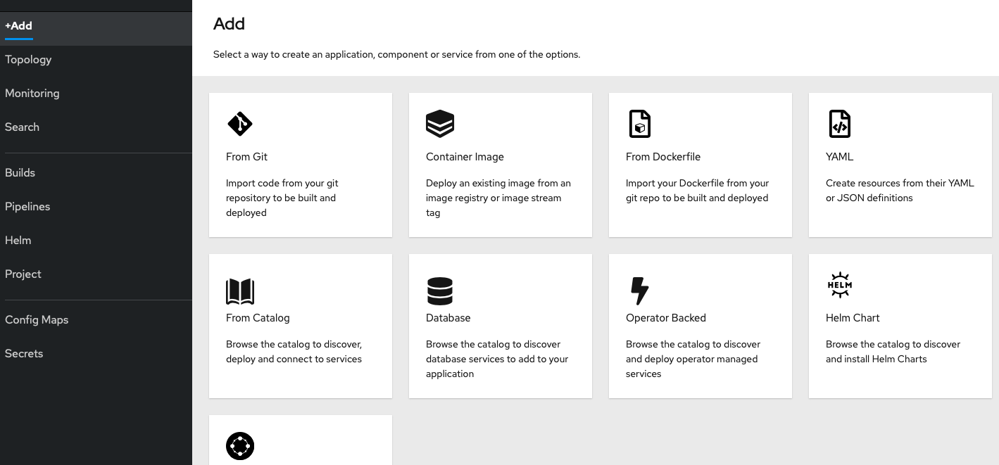
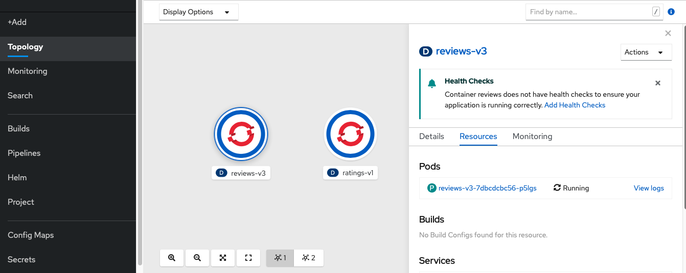

# Yaml Deployment via Web Console

Alternativ können Yaml Manifeste auch per Web Console deployt werden. Hierzu wechseln wir in die Developers View und klicken links oben im Menü auf +Add. Hier sehen wir dann die verschiedenen Deployment Optionen und wählen YAML aus. 



Ein neues Pop-up Window öffnet sich:


Wir legen Service, ServiceAccount und Deployment an. Dafür müssen wir die Prozedur 3 mal wiederholen, da mit dieser methodik nur einzelne Ressource deployt werden können.

```text
apiVersion: v1
kind: Service
metadata:
  name: reviews
  labels:
    app: reviews
    service: reviews
spec:
  ports:
  - port: 9080
    name: http
  selector:
    app: reviews
```

```text
apiVersion: v1
kind: ServiceAccount
metadata:
  name: bookinfo-reviews
  labels:
    account: reviews
```

```text
apiVersion: apps/v1
kind: Deployment
metadata:
  name: reviews-v3
  labels:
    app: reviews
    version: v3
spec:
  replicas: 1
  selector:
    matchLabels:
      app: reviews
      version: v3
  template:
    metadata:
      labels:
        app: reviews
        version: v3
    spec:
      serviceAccountName: bookinfo-reviews
      containers:
      - name: reviews
        image: docker.io/istio/examples-bookinfo-reviews-v3:1.16.2
        imagePullPolicy: IfNotPresent
        env:
        - name: LOG_DIR
          value: "/tmp/logs"
        ports:
        - containerPort: 9080
        volumeMounts:
        - name: tmp
          mountPath: /tmp
        - name: wlp-output
          mountPath: /opt/ibm/wlp/output
      volumes:
      - name: wlp-output
        emptyDir: {}
      - name: tmp
        emptyDir: {}
```

Das Ergebnis des Deployment ist nun neben unserem Ratings Service in der Topology zu sehen:



