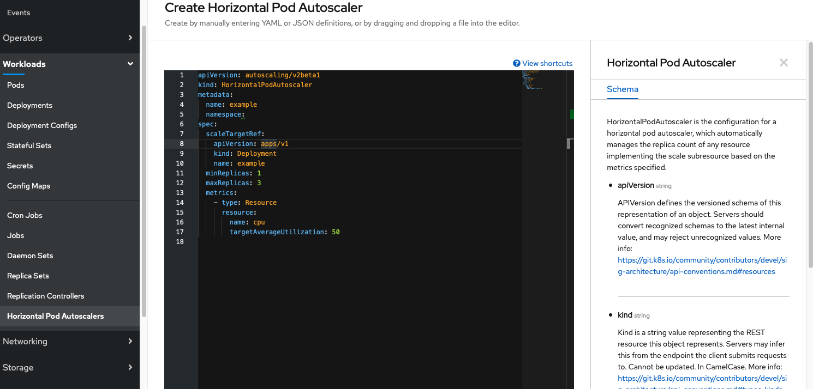

# Horizontal Pod Autoscaler via GUI & YAML

Um ein automatisches Skalieren zu erwirken, müssen wir einen HorizontalPodAutoscaler erstellen. Hierzu wechseln wir wieder in die Administrator View. Wir navigieren zu Workloads/Horizontal Pod Autoscalers und klicken den Create Horizontal Pod Autoscaler Button.



Es öffnet sich der OpenShift YAML Editor mit dem das YAML direkt editiret werden kann. Nicht alle Ressourcen können über Formulare editiert werden. Hierfür steht dann der YAML Editor zur Verfügung \(Syntax Highlighting, Search, etc.\) und zusätzlich eine Inline Dokumentation über die erlaubten Elemente auf der rechten Seite der View.

Damit der Autoscaler unsere productpage skaliert, müssen wir _spec.scaleTargetRef.name_ auf _productpage_ setzen! Beim Reload der Ressource ändert sich deren Status.

Alternativ kann auch per OC automatisch skaliert werden:

```text
oc autoscale deployment productpage --min=1 --max=3 --cpu-percent=50   

horizontalpodautoscaler.autoscaling/productpage autoscaled

```

Der Status des Autoscalers kann abgefragt werden, um zu checken, ob dieser ordnungsgemäß funktioniert:

```text
conditions:
    - type: AbleToScale
      status: 'True'
      lastTransitionTime: '2020-09-14T16:15:43Z'
      reason: SucceededGetScale
      message: the HPA controller was able to get the target's current scale
```

