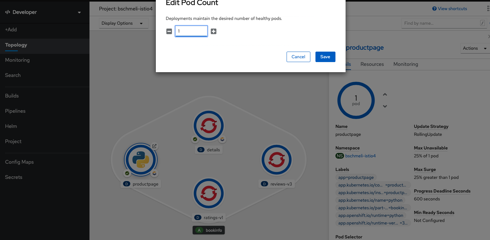
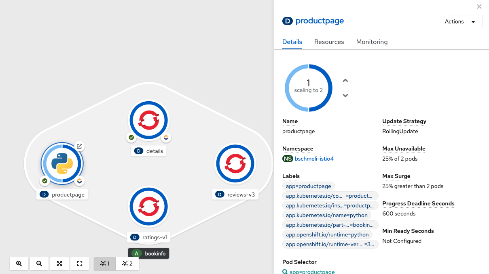

# Manuell via GUI

Wir skalieren den Productpage Pod manuell auf 2 Instanzen. Dies erfolgt entweder über die Topology View über die 2 kleinen Pfeile rechts neben dem blauen Pod Kreis oder aber rechte Maustaste -&gt; Edit Pod Count.



Alternativ können wir auch OC nutzen:

```text
oc scale deployment productpage --replicas=2

deployment.apps/productpage scaled
```

Die Anzahl der Pods ändert sich nun in der Web Console / Topology.



Wenn die Skalierung erfolgt ist, sind dem Deployment 2 Pods zugeordnet. Auch die Monitoring View zeigt die Ressourcen beider Pods an.

