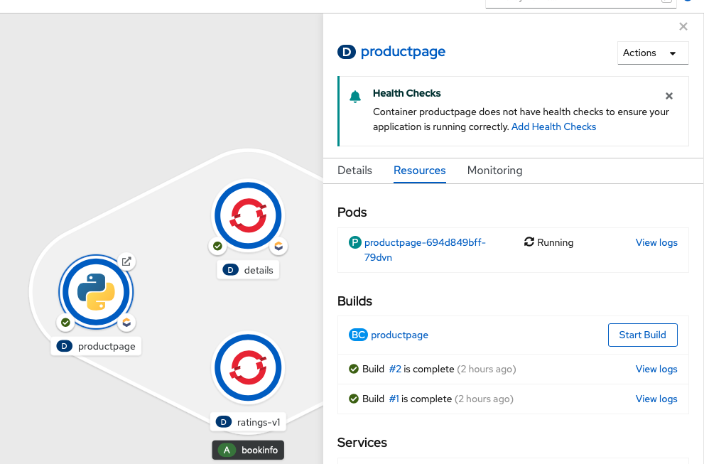
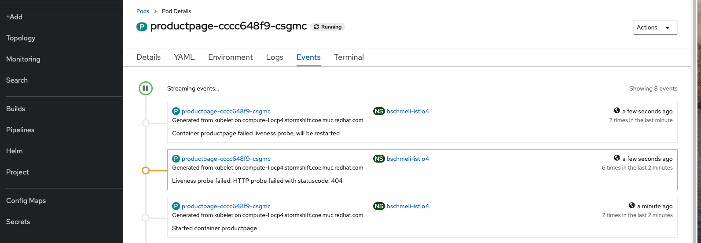

# Health Checks - Readiness & Liveness Probes

OpenShift \(bzw. Kubernetes ebenfalls\) überwacht den Zustand der Pods über sogenannte Readiness und Liveness Probes. Eine Readiness Probe checkt, ob der Prozess innerhalb des Pods erfogreich gestartet ist und bereit ist Anfragen entgegenzunehmen. Die Lifeness Probe überwacht, ob der Pod immer noch auf Anfragen reagiert und startet ihn ggf. neu.

## Readiness Probe

Wir definieren nun eine Readiness Probe auf der Productpage. Hierzu wählen wir wieder das Deployment aus und klicken auf den Hinweis, der uns auffordert einen Health Check hinzuzufügen.

In dem eingeblendeten Formular wählen wir Readiness Probe aus und setzen:

* Path
  * auf /test
* Initial Delay
  * 5sec

Wir können beobachten, dass der neu deployte Pod niemals ready wird, da der Pfad /test in einem 404 error resultiert. Dies veranlasst das Deployment niemals auf die neue Pod Instanz umzuschalten. Wenn wir nun den Path auf / setzen \(rechte Maustaste Edit Health Checks\) geht das Deployment wieder erfolgreich durch.

## Liveness Probe

Wir legen nun eine Liveness Probe an. Hierfür wählen wir wieder Productpage auf und editieren die Health Checks ein weiteres Mal  \(rechte Maustaste Edit Health Checks\). In dem Formular für die Liveness Probe hinterlegen wir folgende Werte:

* Path
  * auf /test
* Initial Delay
  * 10sec

Wir sehen nun, dass der Pod nach ca. 40sec neu gestartet wird. Was hier genau passiert ist auf dem Events Reiter des Pods ersichtlich. Hier finden wir, dass der Pod aufgrund eines 404 Errors neu gestartet wurde.

Wir beheben die fehlerhafte Probe idem wir den Path wieder auf / setzen.

