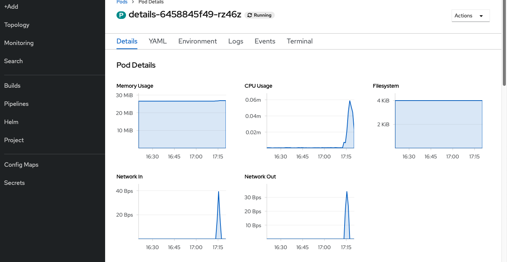
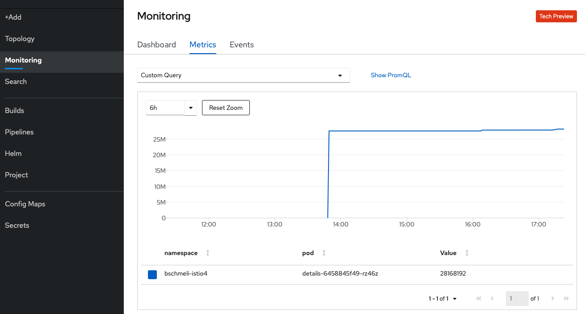
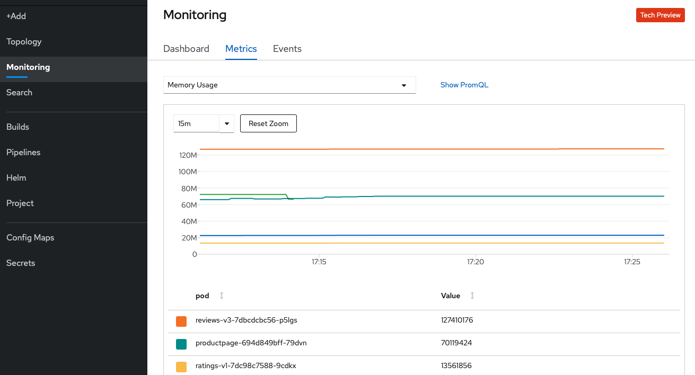

# Monitoring

OpenShift integriert Prometheus, um die Metriken eines jeden Pods \(CPU, Memory, Filesystem, Network\) zu sammeln. Diese Metriken werden dann im Reiter Details in der Pod View der OpenShift Web Console dargestellt.

Bei Klick in eine dieser unterschiedlichen Metrik Visualisierungen kann man in die Montioring Perspektive navigieren. Hier hat man die Möglichkeit zu zoomen oder das Zeitfenster auszuwählen.

Wer noch genauere Analysen machen möchte kann die PromQL verwenden, um eigene Queries auf den Metriken zu definieren.

Wenn über die Linke Hauptnavigation in der Developer View auf das Monitoring Tab geklickt wird, gelangt man in die Projektweite Monitoring View und hat eine Übersicht über alle Ressourcen innerhalb des gesamten Projekts.

