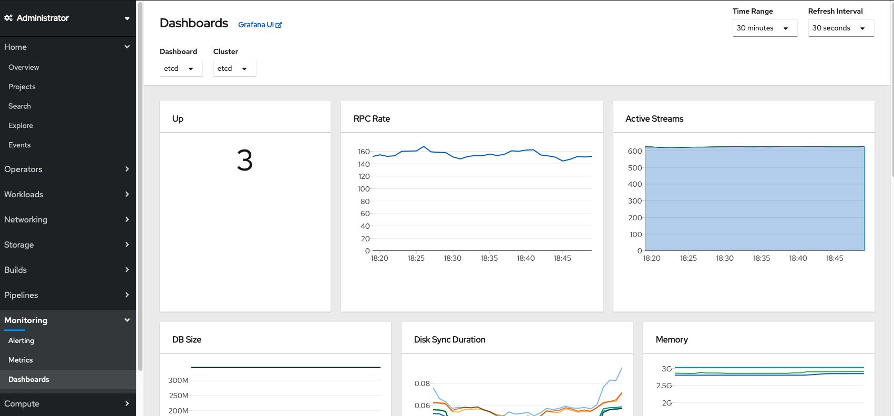
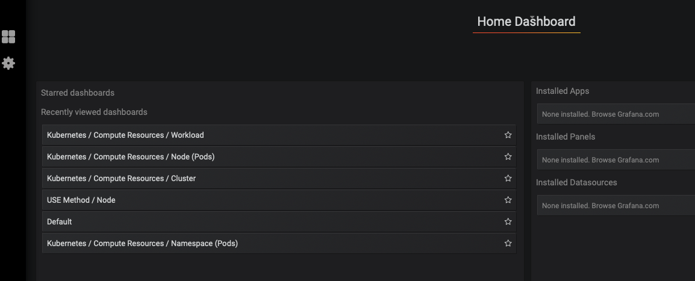
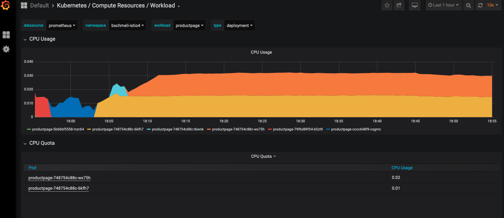

# optional: Administrator Cluster-Monitoring

Zusätzlich zum Monitoring und Logging auf Pod- und Projektebene gibt es weiterhin die Möglichkeit ein clusterweites Logging und Monitoring durchzuführen. Im Folgenden werden wir nur auf das clusterweite Monitoring eigehen, da das Logging die Installation weiterer Komponenten per Operator erfordert.

Für das Monitoring wechseln wir in die Administrator View und klicken auf Monitoring.

Hier gibt es einen Link zum Grafana UI.

Dort wählen wir Workload aus und über die jeweiligen Drop Down unsere Applikation.

