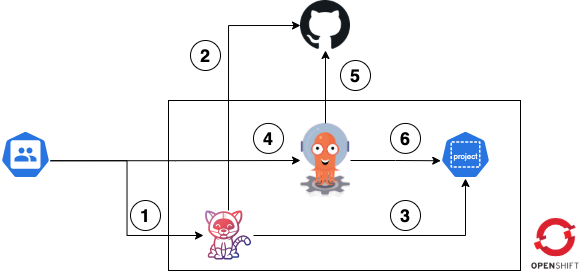

# Übersicht

1. Nutzer startet den Build Prozess.
2. Tekton holt sich den Code vom Repository und führt die Build Schritte aus.
3. Container Image wird in die interne Regsitry des Project gespeichert.
4. Nutzer startet den Deployment Prozess.
5. ArgoCD holt sich die Konfiguration \(Helm Chart\) vom Repository.
6. ArgoCD deployed die App in das Project im OpenShift Cluster.

