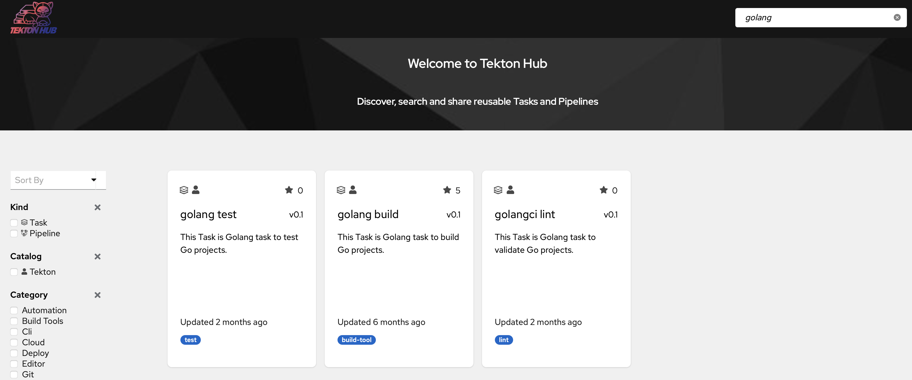
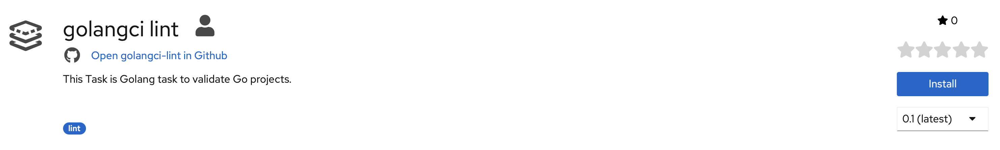
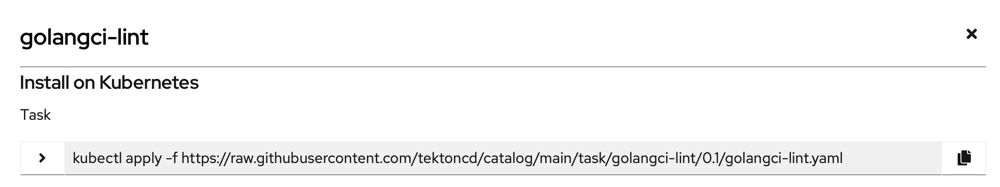
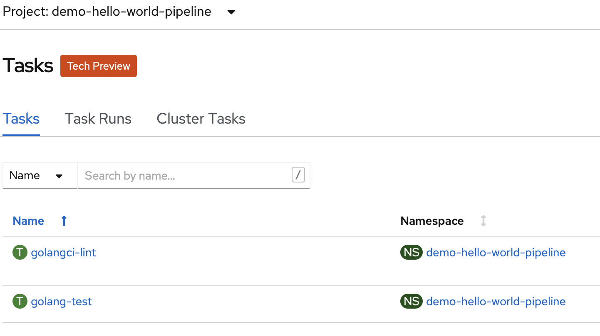

# Tasks anlegen

Es gibt eine Übersicht an Tekton Tasks welche von der Open Source Community maintained werden.





Navigiert zum Tekton Hub und sucht nacht "Golang".



Wählt "golangci lint" aus und kopiert den "install" Befehl.





```text
kubectl apply -f https://raw.githubusercontent.com/tektoncd/catalog/main/task/golangci-lint/0.1/golangci-lint.yaml
```

Die gleichen Schritte führt ihr für den "golang test" Tasks aus.

```text
kubectl apply -f https://raw.githubusercontent.com/tektoncd/catalog/main/task/golang-test/0.1/golang-test.yaml
```

Danach sollten beide Tasks in der "Administrator" Übersicht unter "Pipelines" unter "Tasks" auftauchen.




