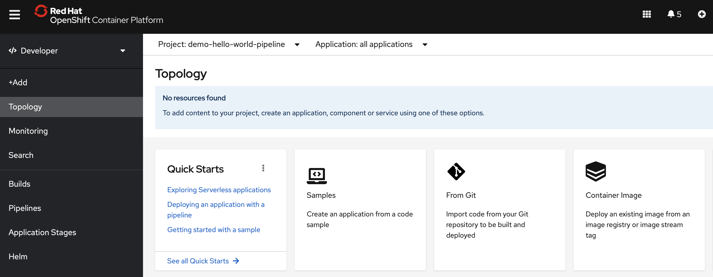
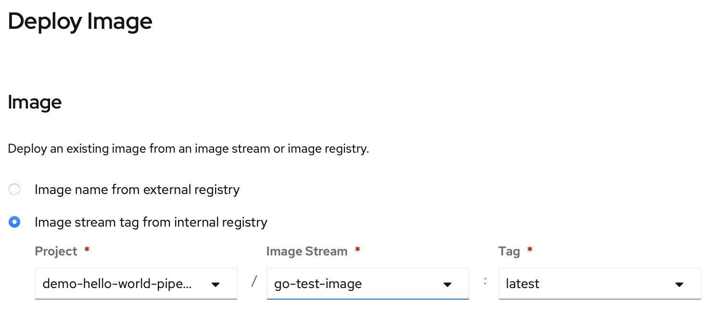
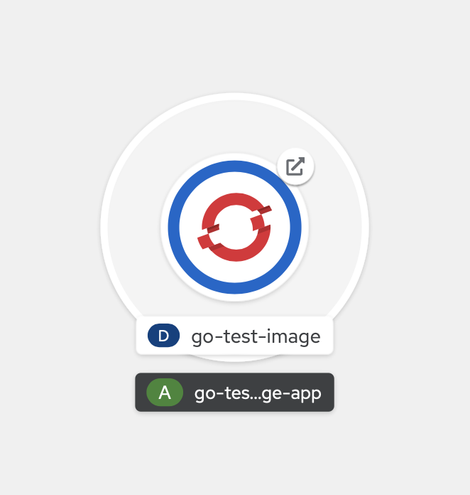

# \[Optional\] Image testen

Wer mag kann gerne das Go Image schon einmal testen.

Unter Topology wählen wir "Container Image" aus.



Wählt "Image stream from internal registry" aus und wählt euer Image und Tag aus. Dann klickt auf "Create".



Wenn die Applikation gestartet ist, klicken wir auf die Route.



Als Ergebnis erhalten wir 

```text
{"message": "not found"}
```

Wenn wir an die Ende der Route noch `/api/v1/hello` hinzufügen \(`<...>cloud/api/v1/hello`\) erhalten wir

```text
{"message": "Hello World"}
```

