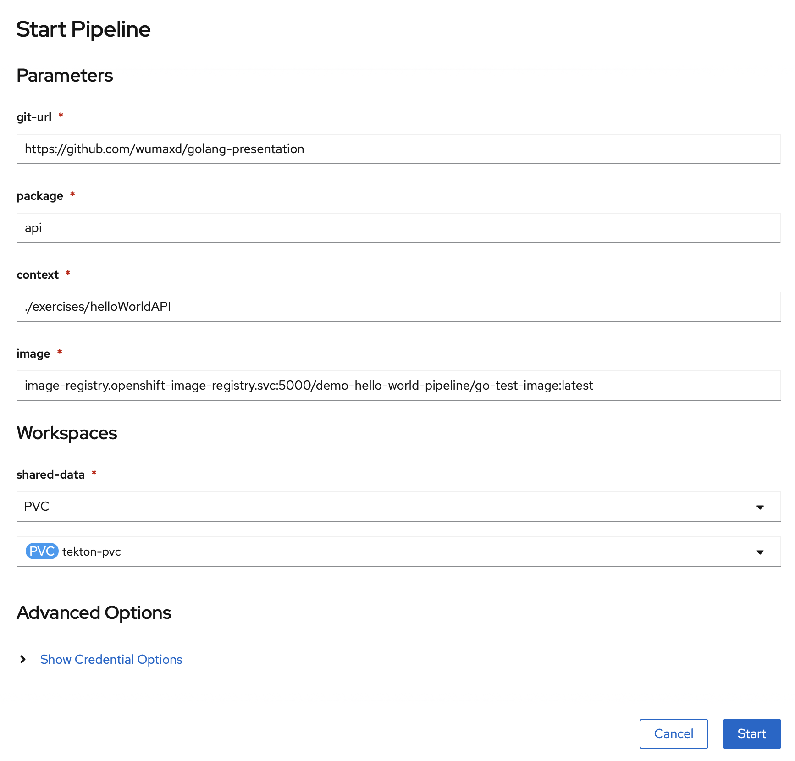

# Pipeline ausführen

In der Pipeline Übersicht wählen wir unter "Actions" "Start" aus.

Wir fügen die folgenden Parameter ein

* git-url: [https://github.com/wumaxd/golang-presentation](https://github.com/wumaxd/golang-presentation)
* package: api
* context: ./exercises/helloWorldAPI


In das Image unten euren Namespace einsetzen


* image: image-registry.openshift-image-registry.svc:5000/**&lt;namespace bzw. project&gt;**/**&lt;name des images&gt;:&lt;tags&gt;**

und wählen den Workspace aus \(PVC - tekton-pvc\).

Außerdem fügen wir bei "Show Credential Options" die Basic-Auth für Github mit einem Verweis auf unser vorhin angelegtes Secret ein.

Dann klicken wir auf "Start".

