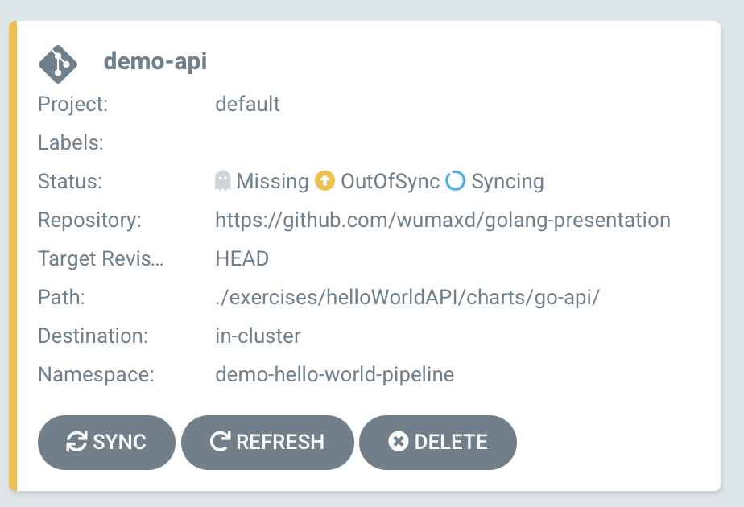
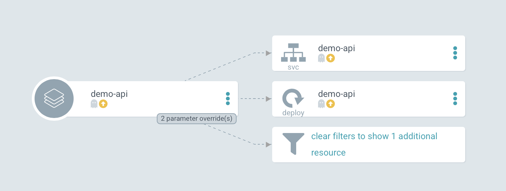
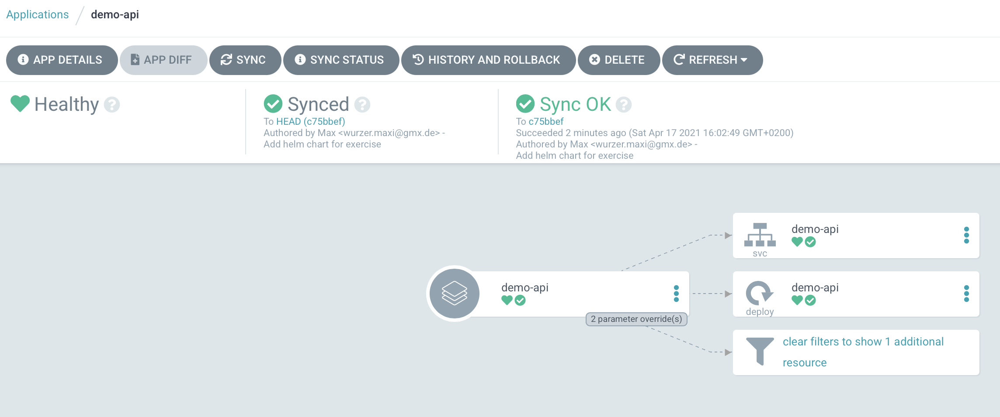
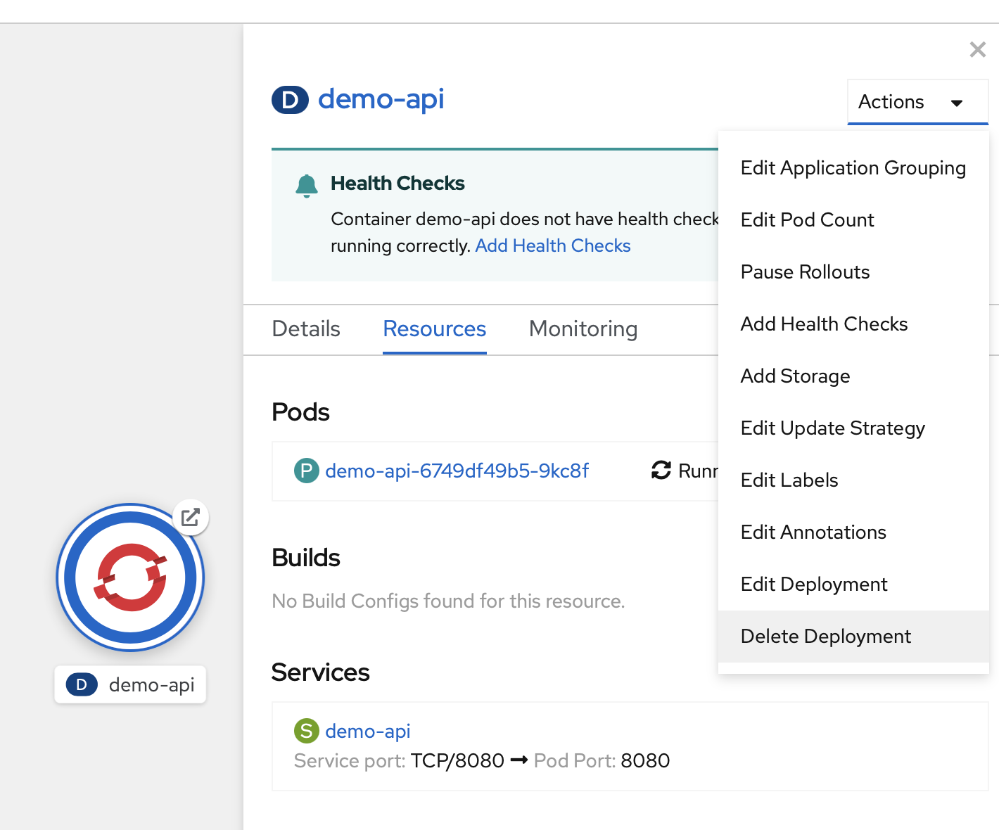

# ArgoCD Sync

Nachdem wir die Applikation erstellt haben, synchronisiert ArgoCD sofort die Konfiguration.





Nachdem das Deployment erfolgreich war, zeigt ArgoCD an, das die Applikation synchronisiert wurde. Wir können den jeweiligen Status und die YAMLs des jeweiligen Services, Routes, etc. in der Oberfläche einsehen.



Wir können jetzt das Deployment testen. In der OpenShift Developer Übersicht klicken wir auf die Route der erstellten Applikation.

Als Ergebnis werden wir

```javascript
{"message": "not found"}
```

erhalten. Da auf der Base Route kein Ergebnis zurückgeben wird. Wir fügen jetzt an die URL noch `/api/v1/hello` an und erhalten

```javascript
{"message": "Hello World"}
```

Zurück in der OpenShift Developer Übersicht löschen wir das erzeugte Deployment. Bei einem Deployment welches über andere Mittel auf das Cluster angewandt wurde, würde damit Applikation entfernt werden. Da wir beim erstellen der Applikation jedoch "Self healing" ausgewählt haben, erzeugt ArgoCD das Deployment erneut.



Sobald die Applikation wieder erstellt wurde, können wir den `/api/v1/hello` Endpunkt erneut aufrufen.

