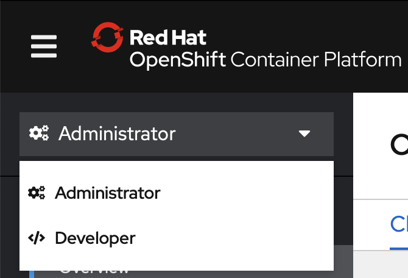
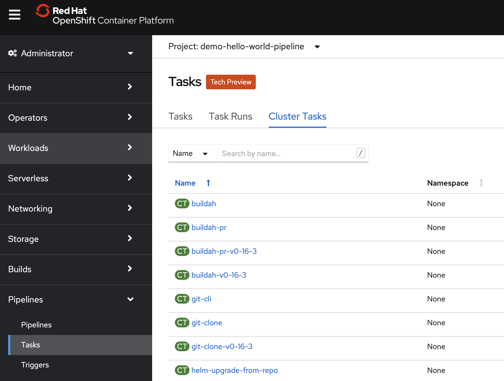

# Cluster Tasks

OpenShift bringt bereits einige "Tasks" mit, welche in eine Pipeline eingebunden werden können. Wir definieren heute zusätzlich noch unsere eigenen. Ein Administrator könnte auch eigene ClusterTasks erstellen um Pipelines weitgehend standardisiert und parametrisiert zu erstellen.

Öffnet die "Administrator" Ansicht

Wählt links unter "Pipelines" "Taks" aus und klickt dann auf "Cluster Tasks".

