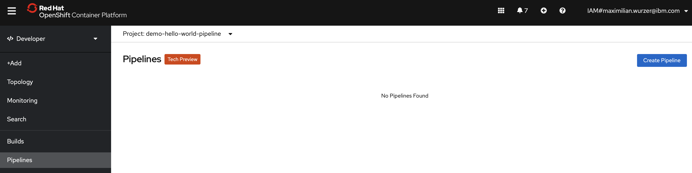
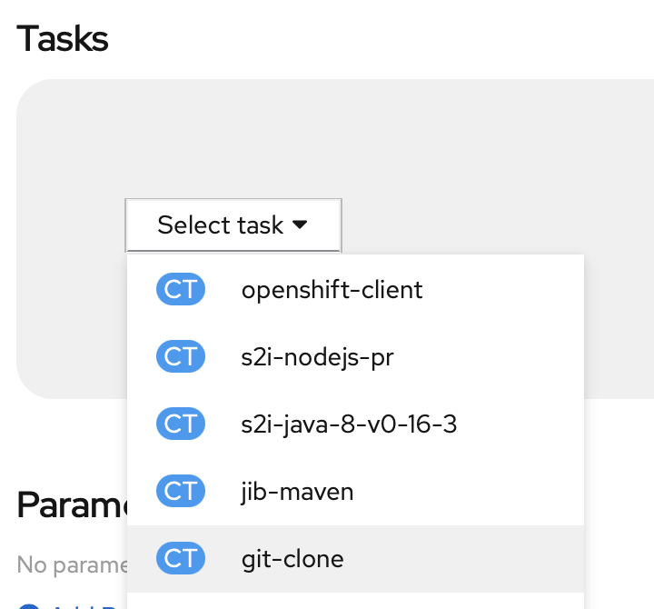
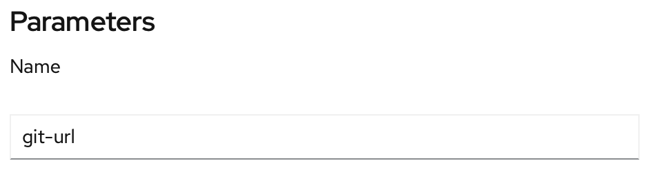
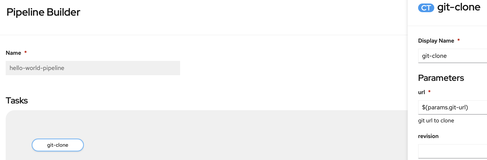
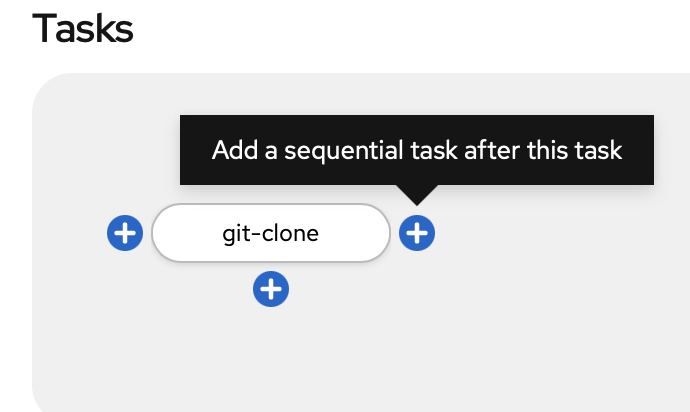
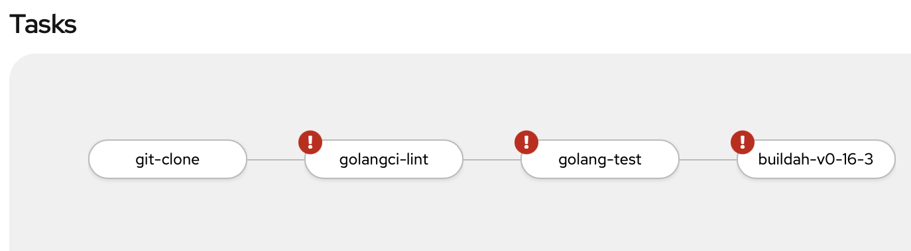
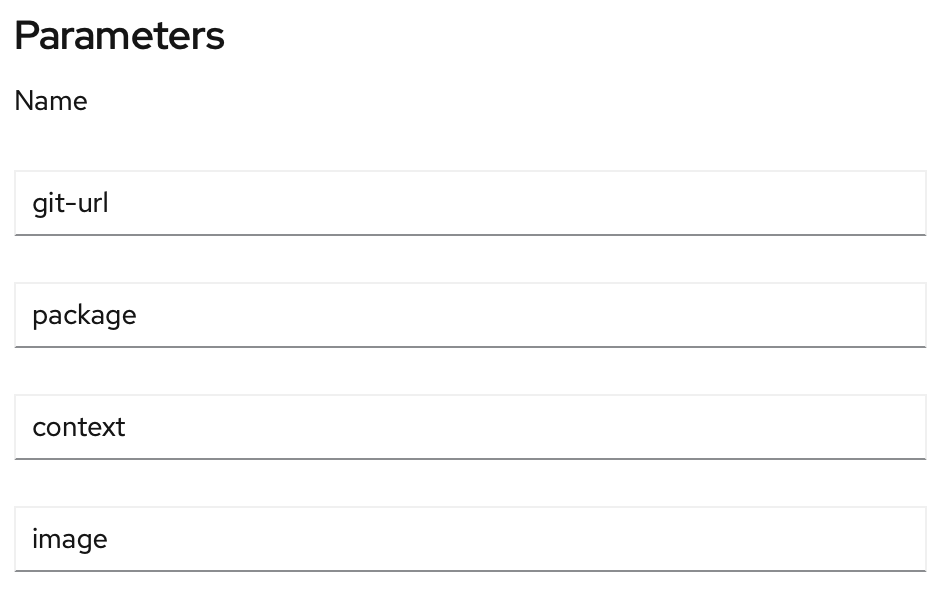
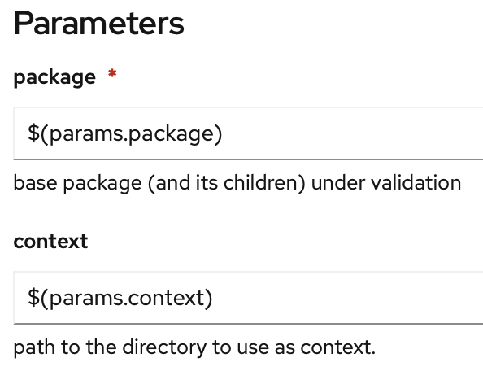
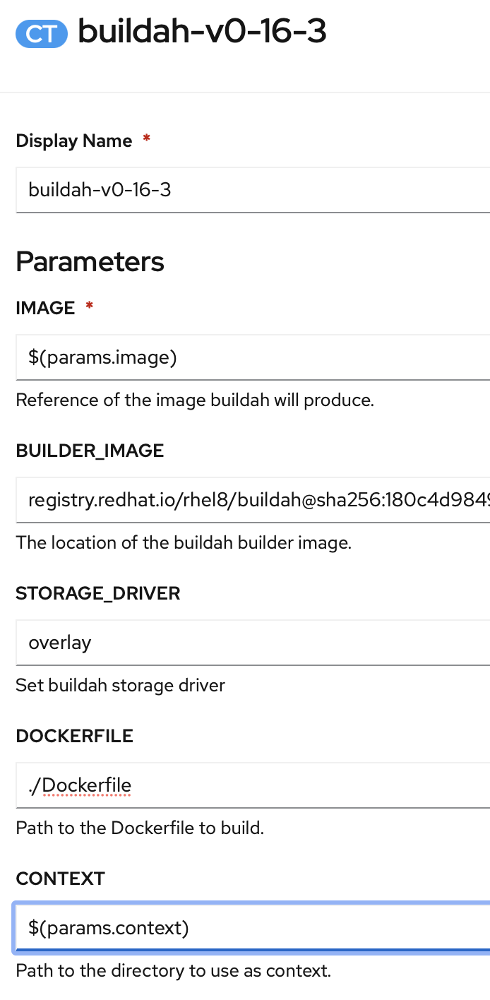
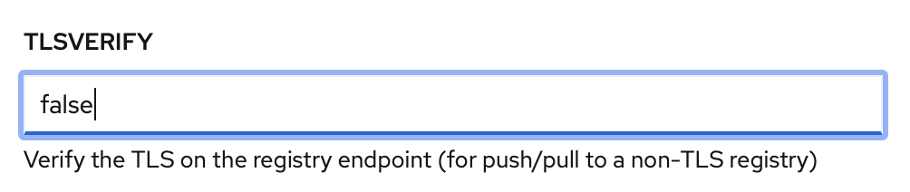

# Pipeline anlegen

Nun erstellen wir eine generische Pipeline, welche für die Schritte

* Liniting
* Testing
* Building

genutzt werden kann.

Öffnet in der "Developer" Ansicht die Sektion "Pipelines" und klickt auf "Create Pipeline".

Tragt den Namen `hello-world-pipeline` ein.

Wählt den Task "git-clone" aus.

Erstellt einen Parameter `git-url`.

Klickt auf den `git-clone` Task und fügt den Parameter `url` ein \(`$(params.git-url)`\).

Fügt die Tasks `golangci-lint`, `golang-test` und `buildah-v0-16-3` als squentielle Task ein.

Das Ergebnis sieht dann so aus.

Erstellt drei Parameter `package`, `context` und `image`.

Passt das Package und den Context im `golangci-lint` und `golang-test` Task an.

Fügt den Parameter `image` und `context` im Buildah Task ein.

Da wir die interne Registry nutzen werden, müssen wir die TLS Verifikation ausschalten.

Klickt auf "Save".

