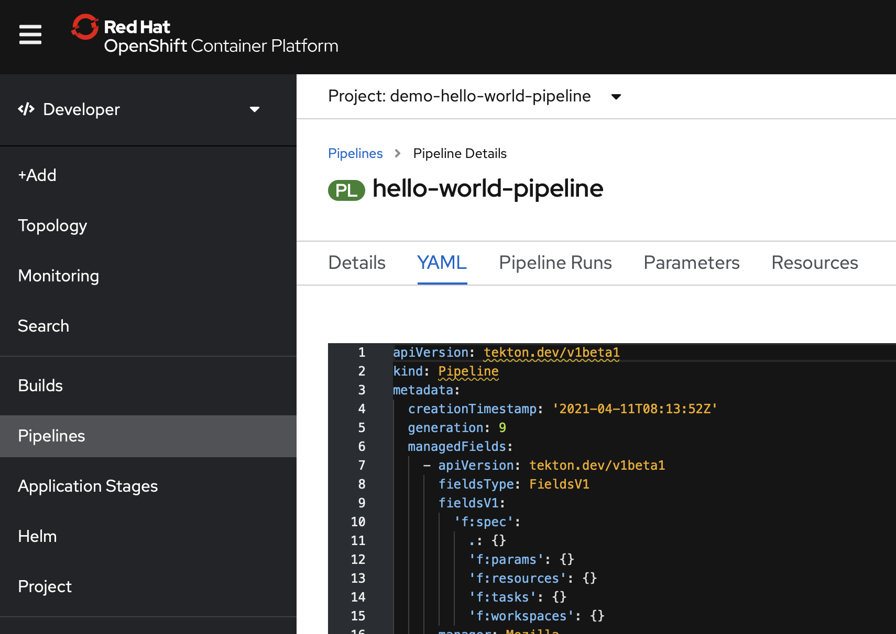

# Workspace einfügen

Da Workspaces noch nicht von der UI unterstützt werden müssen wir diese noch einfügen \(oder kopiert einfach das ganze YML am Ende\).

Wir wählen unsere "hello-world-pipeline" und klicken auf "YAML".



Im `git-clone` Task fügen wir den Workspace wie folgt ein:

```text
    - name: git-clone
      <...>
      workspaces:
        - name: output
          workspace: shared-data
```

Für die Tasks golangci-lint, golang-test und buildah fügen wir den Workspace so ein:

```text
     workspaces:
        - name: source
          workspace: shared-data
```

Als Alternative könnt ihr auch einfach das den `spec` Teil des YMLs ersetzen:

```text
spec:
  params:
    - name: git-url
      type: string
    - name: package
      type: string
    - name: context
      type: string
    - name: image
      type: string
  tasks:
    - name: git-clone
      params:
        - name: url
          value: $(params.git-url)
        - name: submodules
          value: 'true'
        - name: depth
          value: '1'
        - name: sslVerify
          value: 'true'
        - name: deleteExisting
          value: 'true'
        - name: verbose
          value: 'true'
      taskRef:
        kind: ClusterTask
        name: git-clone
      workspaces:
        - name: output
          workspace: shared-data
    - name: golangci-lint
      params:
        - name: package
          value: $(params.package)
        - name: context
          value: $(params.context)
        - name: flags
          value: '--verbose'
        - name: version
          value: v1.21.0
        - name: GOOS
          value: linux
        - name: GOARCH
          value: amd64
        - name: GO111MODULE
          value: auto
      runAfter:
        - git-clone
      taskRef:
        kind: Task
        name: golangci-lint
      workspaces:
        - name: source
          workspace: shared-data
    - name: golang-test
      params:
        - name: package
          value: $(params.package)
        - name: packages
          value: ./...
        - name: context
          value: $(params.context)
        - name: version
          value: latest
        - name: flags
          value: '-race -cover -v'
        - name: GOOS
          value: linux
        - name: GOARCH
          value: amd64
        - name: GO111MODULE
          value: auto
      runAfter:
        - golangci-lint
      taskRef:
        kind: Task
        name: golang-test
      workspaces:
        - name: source
          workspace: shared-data
    - name: buildah-v0-16-3
      params:
        - name: IMAGE
          value: $(params.image)
        - name: BUILDER_IMAGE
          value: >-
            registry.redhat.io/rhel8/buildah@sha256:180c4d9849b6ab0e5465d30d4f3a77765cf0d852ca1cb1efb59d6e8c9f90d467
        - name: STORAGE_DRIVER
          value: overlay
        - name: DOCKERFILE
          value: ./Dockerfile
        - name: CONTEXT
          value: $(params.context)
        - name: TLSVERIFY
          value: 'false'
        - name: FORMAT
          value: oci
      runAfter:
        - golang-test
      taskRef:
        kind: ClusterTask
        name: buildah-v0-16-3
      workspaces:
        - name: source
          workspace: shared-data
  workspaces:
    - name: shared-data

```

Klickt auf "Save".

