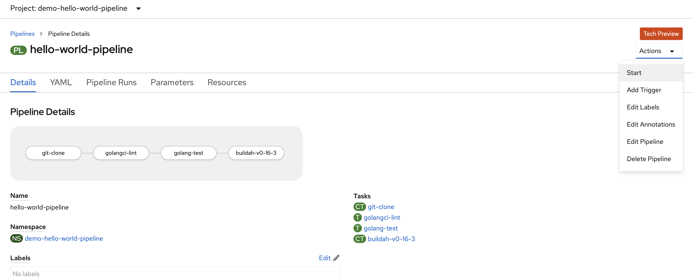

# Pipeline ausführen

In der Pipeline Übersicht wählen wir unter "Actions" "Start" aus.

Wir fügen die folgenden Parameter ein

* git-url: [https://github.com/wumaxd/golang-presentation](https://github.com/wumaxd/golang-presentation)
* package: api
* context: ./exercises/helloWorldAPI


Ins Image unten euren Namespace einsetzen


* image: image-registry.openshift-image-registry.svc:5000/**&lt;namespace bzw. project&gt;**/go-test-image:latest

und wählen den Workspace aus \(PVC - tekton-pvc\).

Dann klicken wir auf "Start".

