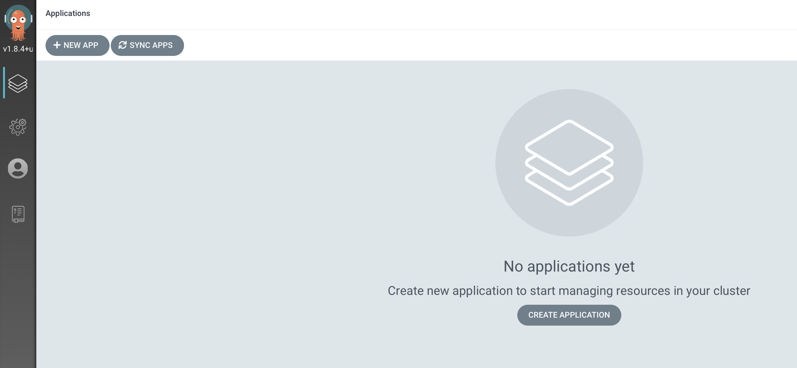

# ArgoCD GUI

Logged euch in der ArgoCD Oberfläche ein.

Username: admin

Password:

```text
oc get secret argocd-cluster-cluster -n openshift-gitops -o jsonpath='{.data.admin\.password}' | base64 -d
```



Damit sehen wir die ArgoCD Übersicht. Wir nutzen für die restlichen Sessions alle den Admin Nutzer.




Alle Informationen zu ArgoCD findet ihr [hier](https://argoproj.github.io/argo-cd/).


